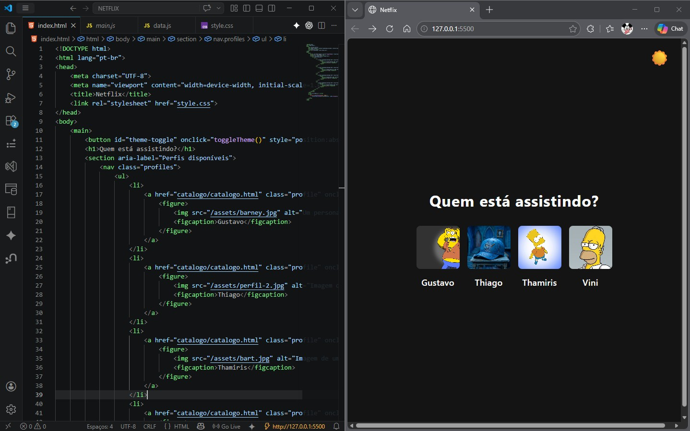
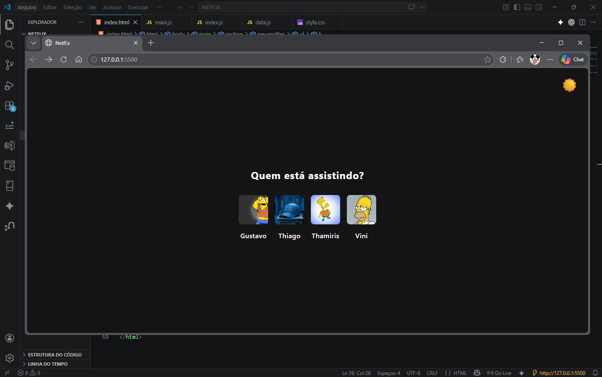

# 🤖 NETLURA-IA

<p align="center">
  
</p>

<p align="center">
  <strong>Plataforma feita com o time Alura e Inteligência Artificial para acelerar desenvolvimento e inovação</strong>
</p>

<p align="center">
  <a href="https://github.com/jmarcosaraujo/NETLURA-IA">
    
  </a>
  <a href="#-demonstração">
    
  </a>
</p>

---

## 📸 Demonstração

<p align="center">
  <a href="https://jmarcosaraujo.github.io/NETLURA-IA/">
    
  </a>
</p>

🔗 **Acesse rapidamente:**  
👉 https://jmarcosaraujo.github.io/NETLURA-IA/

## 🎥 Demonstração em vídeo

<p align="center">
  <a href="https://www.youtube.com/watch?v=7OEfy3jocXY">
    
  </a>
</p>

<p align="center">
  ▶️ Clique na imagem para assistir no YouTube
</p>

---

## ✨ Sobre o projeto

O **NETLURA-IA** é uma solução que utiliza **Inteligência Artificial** para automatizar processos, gerar insights e aumentar a produtividade no desenvolvimento de software.

Projetado para desenvolvedores e entusiastas de IA, o projeto permite explorar o poder dos modelos modernos para:

- ⚡ Automatizar tarefas repetitivas
- 🧠 Gerar código e soluções inteligentes
- 📊 Analisar dados de forma eficiente
- 🔗 Integrar IA em aplicações reais

💡 Ferramentas de IA ajudam desenvolvedores a escrever, revisar e otimizar código com mais eficiência usando modelos avançados de linguagem :contentReference[oaicite:1]{index=1}

---

## 🧠 Tecnologias utilizadas

- 💻 Linguagens: HTML, CSS, JS
- 🤖 IA: Gemini, ChatBot

---

## ⚙️ Como executar o projeto

```bash
# Clone o repositório
git clone https://github.com/jmarcosaraujo/NETLURA-IA.git

# Acesse a pasta
cd NETLURA-IA

# Instale as dependências
npm install

# Execute o projeto
npm run dev

```
---

## 📁 Estrutura do projeto

📦 NETLURA-IA

 ┣ 📂 src
 
 ┣ 📂 assets
 
 ┣ 📂 components
 
 ┣ 📜 README.md
 
 ┗ 📜 package.json

 ---
 
 ## 🚀 Funcionalidades
 
✔️ Integração com IA

✔️ Interface amigável

✔️ Respostas inteligentes

✔️ Escalável e modular

---

## 📌 Roadmap
 Melhorar interface UI/UX
 Adicionar autenticação
 Expandir integração com APIs de IA
 Deploy em produção

 ---
 
## 🤝 Contribuição

Contribuições são muito bem-vindas!

Fork o projeto
Crie uma branch (git checkout -b feature/minha-feature)
Commit suas mudanças
Push (git push origin feature/minha-feature)
Abra um Pull Request

---

## 📄 Licença

Este projeto está sob a licença MIT.

---

## 👨‍💻 Autor

Desenvolvido por João Marcos Araujo 🚀

🔗 https://github.com/jmarcosaraujo

---

## ⭐ Apoie o projeto

Se este projeto te ajudou, deixe uma ⭐ no repositório!

---

